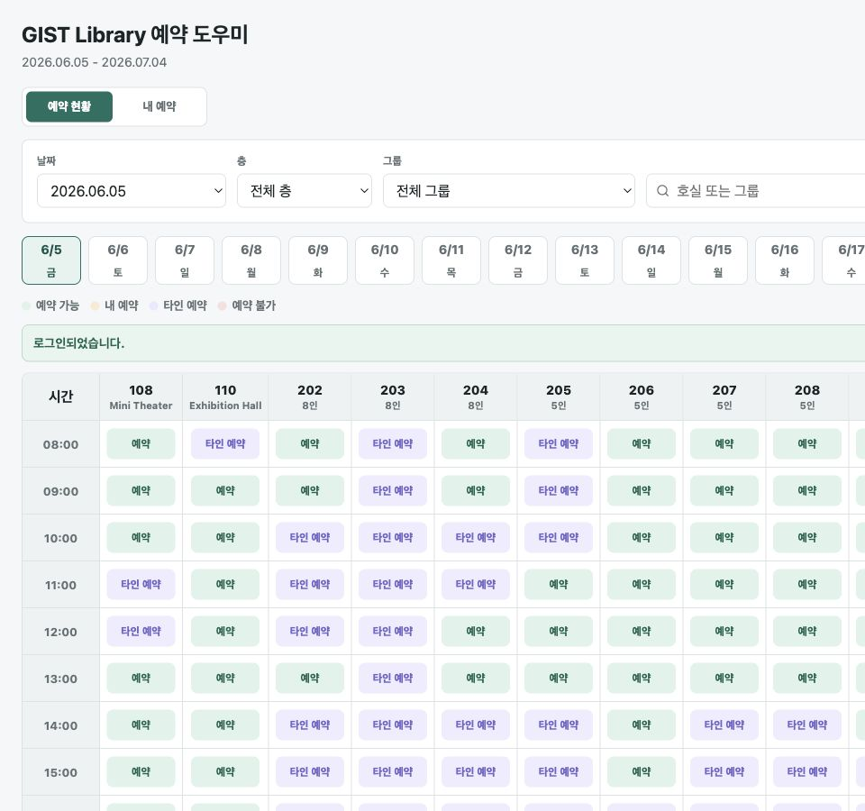
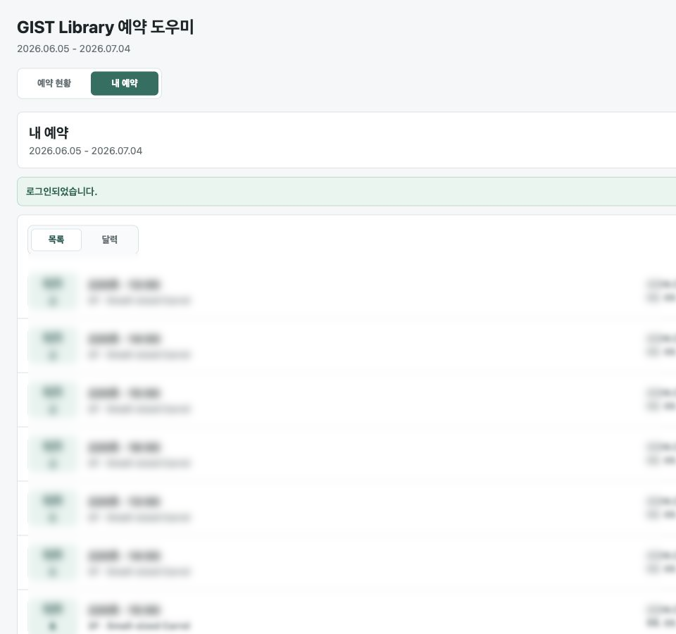
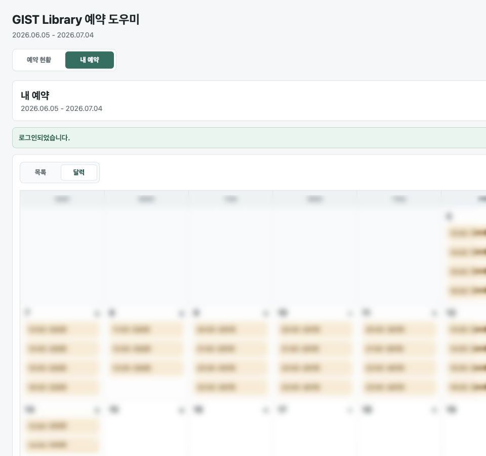

# GIST Library Reservation Assistant

GIST 도서관 시설 예약 현황을 여러 호실 기준으로 한 번에 보고, 사용자가 확인한 1시간 단위 예약과 취소만 실행하는 개인용 웹 앱입니다.

## 어떤 서비스인가

GIST 도서관의 기본 시설 예약 화면은 호실을 하나씩 선택해 날짜별 상태를 확인해야 합니다. 이 앱은 도서관 API를 사용해 예약 가능 기간의 여러 호실을 한 화면에 모아 보여주고, 예약 가능한 칸을 누르면 실제 예약 요청까지 이어지도록 만든 개인용 예약 도우미입니다.

주요 기능:

- 예약 가능 기간의 날짜를 빠르게 이동하며 조회
- 층, 그룹, 검색어 기준으로 호실 필터링
- 시간대별 예약 가능, 내 예약, 타인 예약, 예약 불가 상태 구분
- 1시간 단위 예약과 취소 전 확인 창
- 내 예약 목록과 달력 보기
- 서버 실행 중에는 토큰을 재사용해 날짜 조회마다 다시 로그인하지 않음

## 화면

아래 이미지는 README 공개를 고려해 계정 영역을 잘라내고, 내 예약 상세 일부를 흐림 처리한 예시 화면입니다.

### 예약 현황

날짜별로 전체 호실의 시간대별 상태를 표로 확인합니다. 초록색은 예약 가능, 보라색은 타인 예약, 노란색은 내 예약, 빨간색은 예약 불가 상태입니다.



### 내 예약 목록

내가 예약한 날짜, 호실, 시간대를 목록으로 모아 보고 각 항목에서 바로 취소할 수 있습니다.



### 내 예약 달력

예약이 있는 날짜만 달력에서 확인합니다. 여러 날짜에 흩어진 예약을 한눈에 파악하기 좋습니다.



## 빠른 실행

```sh
npm install
npm run dev
```

브라우저에서 `http://localhost:5173`을 엽니다.

## 문서

- [사용법](./USAGE.md)
- [Vercel 배포 가이드](./docs/VERCEL_DEPLOYMENT.md)
- [배포 보안 검토](./docs/DEPLOYMENT_SECURITY_REVIEW.md)
- [도메인 맥락](./CONTEXT.md)

## 중요한 배포 주의사항

현재 앱은 비밀번호와 토큰을 파일이나 브라우저 저장소에 저장하지 않고, 실행 중인 Node/Vercel 함수 메모리에만 보관합니다. 이 구조는 로컬 개인 사용에는 단순하고 안전하지만, 공개 Vercel URL에서는 여러 방문자가 같은 서버 메모리를 공유할 수 있어 위험합니다.

그래서 Vercel 프로덕션 환경에서는 기본적으로 API가 차단됩니다. 보호된 개인 배포로 위험을 이해하고 진행할 때만 `ALLOW_VERCEL_MEMORY_SESSION=true`를 설정하세요. 공개 또는 다중 사용자 배포는 `httpOnly Secure` 쿠키와 서버 측 세션 저장소로 다시 설계해야 합니다.

## 검증

```sh
npm run typecheck
npm run test
npm run build
npm audit --audit-level=moderate
```
