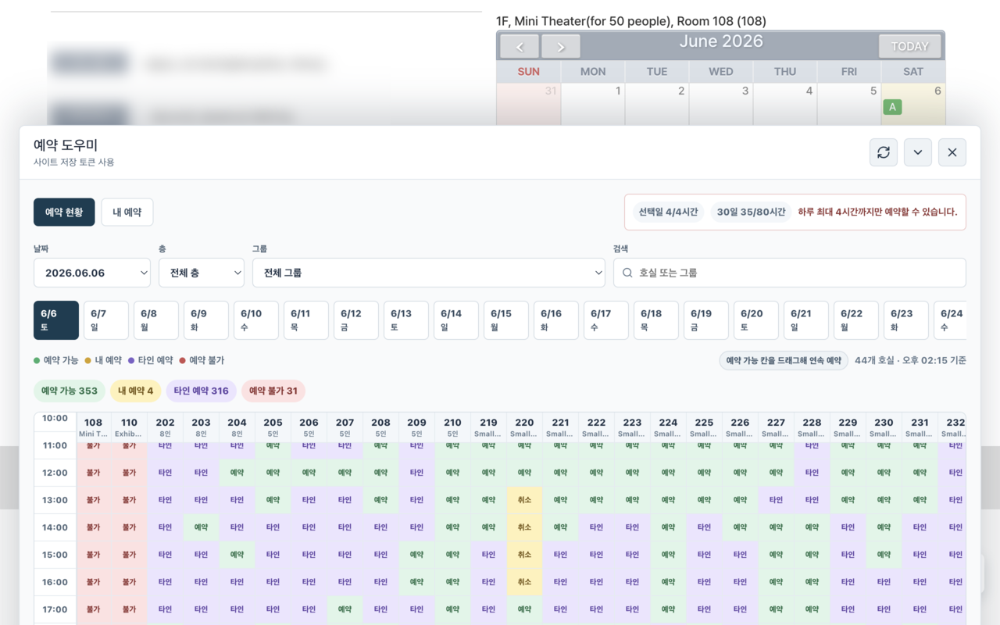
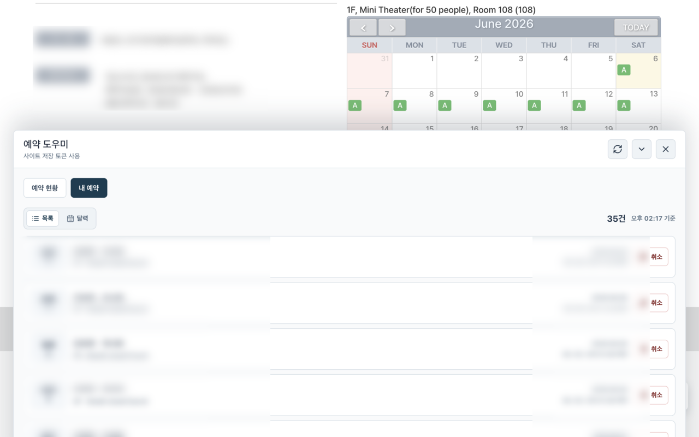
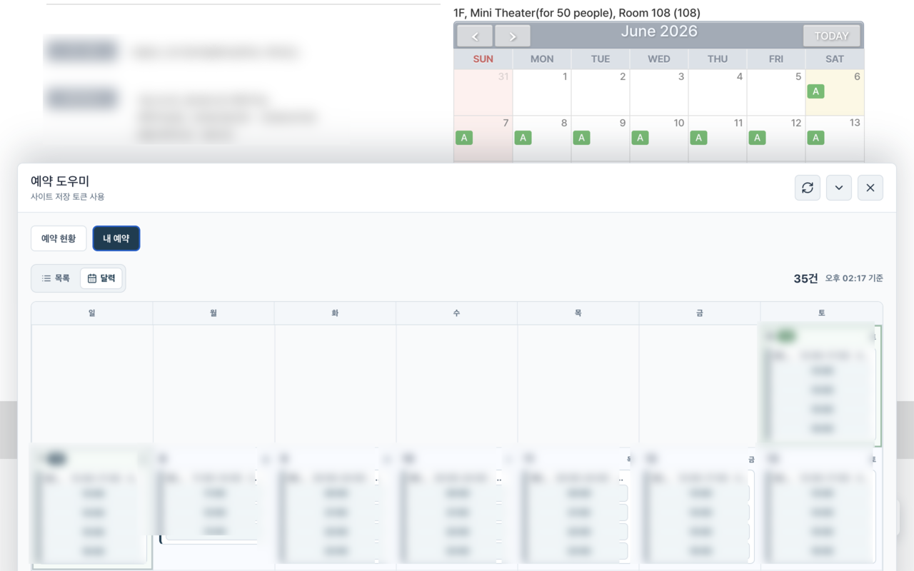

# GIST Library Reservation Assistant

GIST 도서관 공식 시설 예약 페이지에 예약 도우미 UI를 추가하는 Chrome 확장 프로그램입니다.

이 확장은 별도 로그인 시스템이나 외부 서버를 만들지 않습니다. 사용자가 이미 로그인한 GIST 도서관 세션을 사용해 공식 예약 페이지 안에서 예약 현황 조회, 예약, 취소를 수행합니다.

## 주요 기능

- 날짜별 전체 호실 예약 현황 조회
- 층, 그룹, 호실명 기준 필터링
- 예약 가능, 내 예약, 타인 예약, 예약 불가 상태 표시
- 예약 가능한 칸 클릭 예약
- 예약 가능한 칸 드래그로 연속 시간대 예약
- 지난 시간대, 일 최대 4시간, 월 최대 80시간 제한 안내
- 내 예약 목록 보기
- 내 예약 달력 보기
- 예약 취소 전 확인

## 서비스 이용 예시

공식 예약 페이지 위에 예약 도우미 패널이 뜨고, 전체 호실의 날짜별 예약 상태를 한 화면에서 확인할 수 있습니다.



내 예약은 목록으로 확인하고, 각 예약 항목에서 바로 취소할 수 있습니다.



달력 보기에서는 날짜별 예약 분포와 연속 예약 시간을 함께 확인할 수 있습니다.



## 동작 범위

확장 프로그램은 아래 도메인에서만 실행됩니다.

```text
https://library.gist.ac.kr/*
https://library.gist.ac.kr:8443/*
```

권한은 GIST 도서관 예약 페이지 감지, 예약 현황 조회, 사용자가 확인한 예약/취소 요청을 위해 사용됩니다.

## 개발 환경

```sh
npm install
npm run typecheck
npm run test
```

확장 프로그램 개발 빌드:

```sh
npm run build:extension
```

Chrome에서 테스트:

1. `chrome://extensions`를 엽니다.
2. Developer mode를 켭니다.
3. `Load unpacked`를 누릅니다.
4. `dist/extension` 폴더를 선택합니다.
5. `https://library.gist.ac.kr/#/facilityReservation`에 접속합니다.

## 배포 패키지

Chrome Web Store 제출용 zip 생성:

```sh
npm run package:extension
```

생성되는 파일:

```text
dist/gist-library-reservation-assistant-v0.1.0.zip
```

패키징 스크립트는 extension build, manifest version 확인, 필수 파일 존재 여부, Chrome 런타임에서 문제가 되는 `process.*` 참조 여부를 함께 검사합니다.

## 개인정보

이 확장 프로그램은 예약 정보를 별도 서버로 수집하거나 저장하지 않습니다. 예약 데이터는 사용자의 브라우저에서 공식 GIST 도서관 서비스로 직접 요청되며, 패널 렌더링과 사용자가 확인한 예약/취소 작업에만 사용됩니다.

## 프로젝트 구조

```text
extension/        Chrome extension content script and panel UI
shared/           Shared room, date, and availability domain logic
scripts/          Build and packaging helpers
src/              Local development UI
server/           Local API/server code retained for development
```

## 검증

```sh
npm run typecheck
npm run test
npm run build:extension
npm run package:extension
```

## 고지

이 프로젝트는 개인 개발 프로젝트이며 GIST 또는 GIST 도서관의 공식 프로젝트가 아닙니다.
